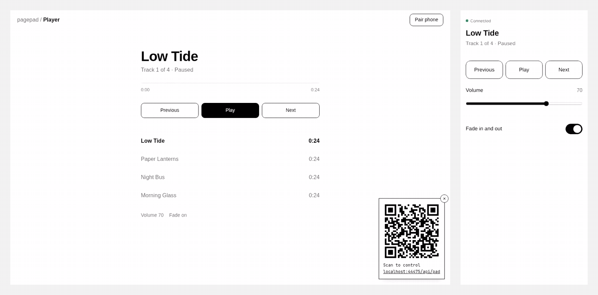

# pagepad

[](https://github.com/iliev-blnk/pagepad/actions/workflows/ci.yml)

Turn a phone into a remote for any web page. Scan a QR code. No app, no WebSocket server.



The page declares its controls, and pagepad builds the phone UI from them. The relay is a
single `Request → Response` handler, so it runs on serverless free tiers, edge runtimes and
plain Node.

## Install

```sh
npm install pagepad
```

## Quickstart

Mount the relay at one URL. With the Next.js App Router:

```ts
// app/api/pad/route.ts
import { createRelay, memoryStore } from 'pagepad/server'

export const { GET, POST } = createRelay({ store: memoryStore() })
```

Then, in the page you want to control:

```js
import { createHost } from 'pagepad/host'

const host = await createHost({ endpoint: '/api/pad' })

host.controls({
  prev: { button: 'Previous' },
  next: { button: 'Next' },
  volume: { slider: [0, 100] },
})
host.on('next', () => player.next())
host.on('volume', (v) => (player.volume = v / 100))
host.setState({ title: 'Paper Lanterns', volume: 70 })

host.showQR()
```

Scan the code and the phone opens a remote with those three controls. `memoryStore` is for
local development. Deployed apps need a shared store, see [Stores](#stores).

## Controls

| Control | Phone shows | Value sent |
|---|---|---|
| `{ button: 'Label' }` | button | `null` |
| `{ toggle: 'Label' }` | switch | `true` / `false` |
| `{ slider: [min, max, step?] }` | range slider | number |
| `{ select: ['a', 'b'] }` | segmented buttons | the chosen string |

Up to four buttons in a row share one line. Call `controls()` again at any time to change the
remote, for example to relabel Play as Pause.

`setState` shallow-merges into the state shown on the phone. `title` and `subtitle` become the
header. A state key with the same name as a control sets that control, so `volume: 70` moves
the volume slider.

```js
host.on('*', (action, value) => log(action, value)) // every action
const off = host.on('next', next)                  // returns an unsubscribe function
host.pairUrl                                       // place the QR code yourself
host.onPairUrl((url) => drawQR(url))               // the URL changes if the session is renewed
host.close()                                       // ends the session; the phone is told
```

## Custom remotes

Use the built-in phone UI, or build your own with the remote client:

```js
import { connect } from 'pagepad/remote'

const pad = connect(pairUrl) // the URL from the QR code
pad.onState(({ state, controls }) => render(state))
pad.onEnd(() => showMessage('Session ended'))
await pad.send('volume', 40)
```

## Stores

| Store | Import | Use it for | Atomic |
|---|---|---|---|
| `memoryStore()` | `pagepad/server` | local development, one Node process | yes |
| `upstashStore({ url, token })` | `pagepad/stores/upstash` | production on any runtime | yes |
| `vercelStore()` | `pagepad/stores/vercel` | Vercel, zero setup | no |

A non-atomic store can lose a command when two phones press a button at the same moment. Use
it with one remote at a time. The relay prints a warning at startup when the store is not
atomic.

```ts
import { createRelay } from 'pagepad/server'
import { upstashStore } from 'pagepad/stores/upstash'

export const { GET, POST } = createRelay({
  store: upstashStore({
    url: process.env.UPSTASH_REDIS_REST_URL!,
    token: process.env.UPSTASH_REDIS_REST_TOKEN!,
  }),
})
```

A store is four methods (`get`, `set`, `push`, `range`) and an `atomic` flag, so other
backends are a small file. See `src/stores/upstash.ts`.

## Deploying

The relay holds a poll open for up to 25 seconds. Give the route a timeout above that.

**Next.js / Vercel**

```ts
export const maxDuration = 30
export const { GET, POST } = createRelay({ store })
```

**Hono, Cloudflare Workers, Bun, Deno**

```ts
const relay = createRelay({ store })
app.all('/api/pad', (c) => relay.handler(c.req.raw))
```

**Cross-origin**

The relay answers same-origin requests only. If the page or a custom remote lives on another
origin, list it:

```ts
createRelay({ store, allowOrigin: ['https://slides.example.com'] })
```

**Node and Express**

```ts
import { createServer } from 'node:http'
import { toNodeHandler } from 'pagepad/node'

createServer(toNodeHandler(createRelay({ store }))).listen(3000)
```

## How it works

The page creates a session and gets a session id, a host token and a secret. The QR code holds
the relay URL with the session id in the query and the secret in the `#fragment`, which
browsers never send to the server, so it stays out of request logs. The page long-polls the
relay for commands and posts its state, and the phone sends commands and reads state once a
second. When the page closes it ends the session, and the phone shows that it has to be
scanned again.

Long-polling instead of WebSockets is deliberate. Serverless functions cannot hold a socket
open, and a poll that resolves wakes up a page that the browser has throttled in a background
tab. A command the relay has held for more than 60 seconds is dropped, so a phone left in a
pocket cannot replay old taps.

## Limits

- State up to 16 KB, command values up to 1 KB, action names up to 64 characters.
- The queue keeps the last 50 commands.
- A session ends when the page closes or reloads, or two minutes after the page stops
  responding. The phone then shows "Session ended".
- No rate limiting. If your relay URL is public, put it behind your own limiter.
- Cost: a waiting page reads the store about every 750 ms, and a paired phone reads it once a
  second. On the Upstash free tier (500K commands a month) that is roughly 25 hours a month of
  a page with a phone attached. Raise `pollStepMs` in `createRelay` to trade a little latency
  for fewer reads.

## Security

Anyone who has the QR code or the pair link controls the page until the session ends. The
secret in the link does not rotate. If the page is on a projector or a shared screen, hide the
code once your phone is paired (`host.hideQR()` or the × on the card), and reload the page to
cut off everyone who scanned it.

## Demos

```sh
pnpm install
pnpm build
node demo/server.mjs
```

The server prints a local address and a network address. Open the network address on your
computer so your phone can reach it, then pick a demo: slides, a music player with synthesised
tracks, or a sketch pad.

## License

MIT
